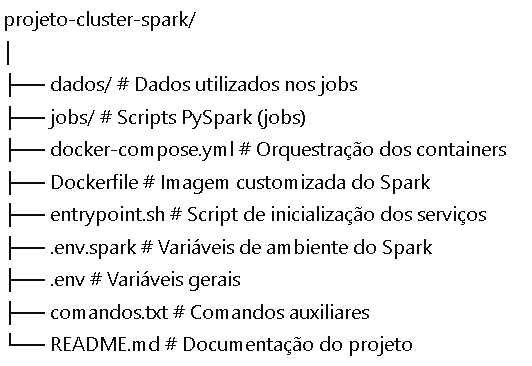

# 🚀 Cluster PySpark com Docker

Este projeto configura um **cluster Apache Spark standalone** utilizando Docker, permitindo a execução de **processamentos batch e streaming** com PySpark de forma simples e escalável.

---

## 📌 Objetivo

Provisionar rapidamente um ambiente distribuído com:

- 🔹 Spark Master  
- 🔹 Múltiplos Spark Workers  
- 🔹 Spark History Server  
- 🔹 Execução de jobs PySpark  
- 🔹 Persistência de logs e dados  

---

## 🧱 Arquitetura

O cluster é composto pelos seguintes serviços:

- **spark-master**: Gerencia o cluster
- **spark-worker**: Executa os jobs distribuídos
- **spark-history-server**: Interface para visualizar execuções passadas

---

## 📂 Estrutura do Projeto



---

## ⚙️ Pré-requisitos

Antes de começar, você precisa ter instalado:

- Docker
- Docker Compose

---

## 🚀 Como executar o projeto

### Subir o cluster

Na pasta raíz do projeto:

docker-compose up -d --scale spark-worker=2

Isso irá iniciar:

1 Spark Master

2 Spark Workers

1 History Server

🌐 Interfaces Web

Após subir o cluster, você pode acessar:

🧠 Spark Master UI

http://localhost:9091

📊 Spark History Server

http://localhost:18081

📦 Volumes e Persistência

Os dados e logs são persistidos através de volumes:

./dados → Dados utilizados pelos jobs

./jobs → Aplicações PySpark

spark-logs → Logs e eventos do Spark

🐳 Customização da Imagem

A imagem Docker é construída a partir do Dockerfile, permitindo:

Instalação de dependências adicionais

Customização do ambiente PySpark

Configuração do Spark

▶️ Execução de Jobs

Os jobs devem ser adicionados na pasta:

/jobs

E podem ser submetidos ao cluster via Spark submit (dentro do container ou via configuração externa).

📈 Escalabilidade

Você pode aumentar o número de workers facilmente:

docker logs pyspark-master

🛠️ Troubleshooting

Ver logs:

docker logs pyspark-master

Reiniciar cluster:

docker-compose down

docker-compose up -d

📚 Tecnologias Utilizadas

Apache Spark

PySpark

Docker

Docker Compose

---

## 🧪 Processos e Jobs PySpark

O projeto contém scripts responsáveis por simular um fluxo de dados e processamento distribuído utilizando PySpark. Abaixo está a descrição de cada um:

---

### 📄 gera-json.py

Este script é responsável pela **geração de dados simulados em formato JSON**.

#### 🔹 O que ele faz:
- Cria registros fictícios (ex: pacientes, eventos ou dados transacionais)
- Estrutura os dados em formato JSON
- Salva os arquivos na pasta `dados/`

#### 🎯 Objetivo:
Simular uma **fonte de dados bruta (raw/bronze)** para ser consumida pelos jobs do Spark.

---

### 🗄️ cria-database.py

Este script realiza a **criação da estrutura de banco de dados/tabelas** no ambiente Spark.

#### 🔹 O que ele faz:
- Inicializa uma SparkSession
- Cria databases (schemas)
- Define tabelas para armazenamento dos dados processados
- Pode utilizar formatos como Parquet ou Delta (dependendo da implementação)

#### 🎯 Objetivo:
Preparar a **camada estruturada (silver/gold)** para receber os dados transformados.

---

### ⚙️ projeto1.py

Este é o principal job de processamento do projeto.

#### 🔹 O que ele faz:
- Lê os dados JSON gerados (camada bronze)
- Realiza transformações com PySpark, como:
  - Limpeza de dados
  - Seleção de colunas
  - Conversões de tipos
  - Enriquecimento de dados
- Escreve os dados processados nas tabelas criadas

#### 🔄 Fluxo simplificado:

JSON (dados/) → Leitura (Spark) → Transformação → Escrita (tabelas)

#### 🎯 Objetivo:
Demonstrar um pipeline básico de **engenharia de dados com Spark**, simulando um fluxo ETL.

---

## 🔁 Pipeline de Dados

O fluxo completo do projeto segue a seguinte ordem:

1. **Geração dos dados**
   ```bash
   python gera-json.py

2. **Criação do banco/tabelas**
   ```bash
   python cria-database.py

3. **Processamento dos dados**
   ```bash
   python projeto1.py

---

## 🧠 Conceitos Aplicados

Arquitetura em camadas (Bronze → Silver → Gold)

Processamento distribuído com Spark

ETL (Extract, Transform, Load)

Data Lake (armazenamento em arquivos)

Containerização com Docker

---

## 💡 Observação

Os scripts foram desenvolvidos com foco educacional, simulando um cenário real de engenharia de dados, podendo ser facilmente adaptados para:

Integração com APIs

Uso de dados reais

Orquestração com Airflow

Armazenamento em cloud (AWS S3, Azure Data Lake, etc.)